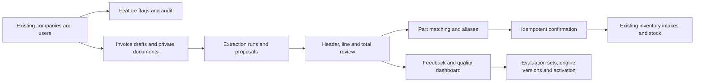

# Invoice recognition database migration

## Baseline and scope

The migration chain is additive and starts from the Brownfield schema that was
observed before invoice-recognition development. The guarded preflight requires
the existing tenant and inventory foundations:

- `companies`
- `users`
- `inventory_parts`
- `inventory_intakes`
- `inventory_intake_items`

The optional `company_integrations` table is **not required, created, altered or
dropped** by this migration chain. It was absent from the inspected remote
baseline, and the integration suite explicitly verifies that the complete
migration chain succeeds without it. QuickBooks columns already present on the
inventory tables are preserved, but QuickBooks behavior is outside this
module's scope.

## Schema delta



The chain creates these module-owned groups:

| Area | Tables |
| --- | --- |
| Rollout and audit | `company_invoice_feature_flags`, `invoice_audit_events` |
| Documents and drafts | `invoice_documents`, `invoice_source_assets`, `invoice_review_drafts` |
| Extraction | `invoice_extraction_runs`, `invoice_provider_attempts`, `invoice_provider_webhook_events`, `invoice_extraction_proposals` |
| Human review | `invoice_review_headers`, `invoice_review_lines`, `invoice_review_totals` |
| Inventory matching | `invoice_line_matches`, `invoice_part_aliases` |
| Confirmation | `invoice_confirmation_intents` |
| Feedback | `invoice_feedback_events` |
| Evaluation and activation | `invoice_engine_versions`, `invoice_evaluation_sets`, `invoice_evaluation_examples`, `invoice_evaluation_runs`, `invoice_engine_activations` |

It also adds invoice-review metadata needed for adjustment, service and direct
expense classifications. Service and direct-expense lines remain in invoice
totals but never create inventory records or change stock quantities. The
release migration uses `gpt-5.6-luna` and synchronous provider execution as the
defaults for new extraction runs.

## Versioned migration order

| File | Purpose |
| --- | --- |
| `0000_invoice_recognition_module.sql` | Complete additive invoice-recognition schema, final constraints and Luna/synchronous defaults |

The development migrations were consolidated before delivery because none had
been applied to the client database. Replit applies this release as one guarded
migration and records one integrity hash. The preflight remains separate so an
incompatible Brownfield database fails before any schema change.

## Safety characteristics

- A preflight validates the Brownfield tables, columns and constraints before
  the first module migration runs.
- PostgreSQL advisory locking prevents two deploys from applying the chain at
  the same time.
- Every applied file is recorded with a SHA-256 hash in
  `drizzle.__drizzle_migrations`; changing an applied migration causes a hard
  failure.
- DDL is transactional except for indexes that PostgreSQL requires to be
  created concurrently.
- Re-running the migration is idempotent.
- The migration runner never reads `REMOTE_DATABASE_URL`.

## Pre-deployment verification

Run against a production-like database copy first:

```sh
npm run db:migrate:check
INVOICE_MIGRATION_APPROVED=true npm run db:migrate
npm run check
npm run test:invoice-pilot
```

## Post-migration verification

The journal should contain one consolidated invoice migration entry:

```sql
SELECT count(*) AS invoice_migration_count
FROM drizzle.__drizzle_migrations
WHERE created_at = 1784764900000;
```

Confirm the principal objects:

```sql
SELECT to_regclass('public.invoice_review_drafts') AS drafts,
       to_regclass('public.invoice_extraction_runs') AS extraction_runs,
       to_regclass('public.invoice_confirmation_intents') AS confirmations,
       to_regclass('public.invoice_feedback_events') AS feedback,
       to_regclass('public.invoice_engine_activations') AS activations;
```

Confirm that the model default is aligned:

```sql
SELECT column_default
FROM information_schema.columns
WHERE table_schema = 'public'
  AND table_name = 'invoice_extraction_runs'
  AND column_name IN ('model', 'execution_mode')
ORDER BY column_name;
```

## Rollback strategy

These migrations intentionally do not ship destructive down-migrations. If a
production issue occurs:

1. Disable `scan_extraction` and `stock_confirmation` for the affected company.
2. Keep the manual Receive Inventory workflow available.
3. Preserve audit and confirmation records for investigation.
4. Restore the pre-deployment database backup only if schema rollback is truly
   required and after confirming that no valid receipts would be lost.

Confirmed receipts are immutable from this module; later corrections use the
existing inventory adjustment workflow.
